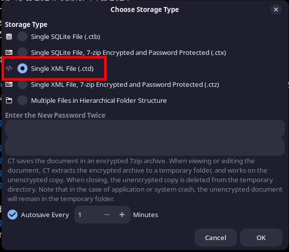
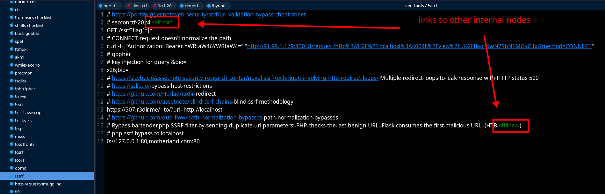
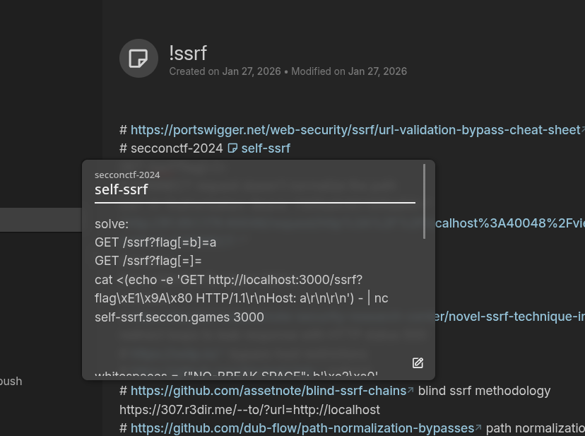

+++
title = 'Migrating My Notes With cherrytree2trilium'
date = 2026-01-28T20:29:03+01:00
categories = ['software']
+++

## Intro

I had a quite large (~363MB) CherryTree database that I wanted to convert to Trilium. I stumbled upon the [cherrytreetomarkdown](https://gitlab.com/kibley/cherrytreetomarkdown) project, modified it a bit and used it alongside [trilium-py](https://github.com/Nriver/trilium-py) to suit my needs. This project may or may not lack some migration features, but it allowed me to successfully migrate my CherryTree database to Trilium and I figured out it might help others too. The project is available [here](https://github.com/ShellUnease/cherrytree2trilium).

## Usage

- Install Trilium,
- Get the ETAPI token from `Hidden Notes / Options / ETAPI`,


- Convert your CherryTree file to `.ctd` format,



- Run `run.sh`
```
Usage: ./run.sh <trilium_url> <etapi_token> <input_file.ctd>  
For example: ./run.sh http://localhost:8080 SOME_ETAPI_TOKEN test.ctd
```

## Result

I successfully migrated my CherryTree db to Trilium while maintaining formatting, tree structure, images and even internal link nodes. Here's an example note in CherryTree:



And here is the same note in Trilium after migration:


As you can see, the hashtags were sanitized properly as well as links to other internal nodes:



## Credits

- [cherrytreetomarkdown](https://gitlab.com/kibley/cherrytreetomarkdown)
- [trilium-py](https://github.com/Nriver/trilium-py)

XOXO,  
VXXDXX