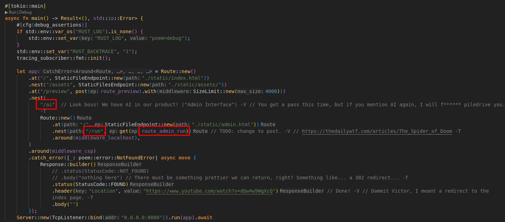
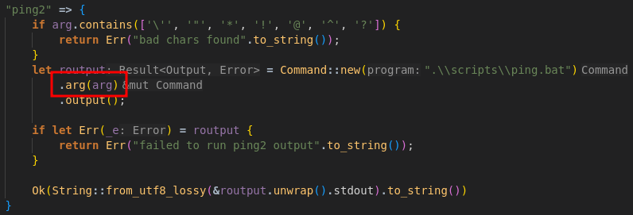
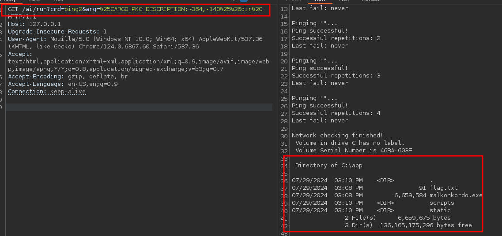

+++
title = 'CrewCTF 2024 Malkonkordo'
date = 2024-07-29T13:00:00+02:00
categories = ['CrewCTF 2024', 'Web']
+++


## Source Code Analysis

Upon inspecting the code, we find that there's ```/ai/run``` path that sounds like it could let us execute something.



It's "guarded" by middleware that inspects whether host in the uri or the request header 'host' starts with ```127.0.01```.


Afterwards, the execution is passed to ```handle_cmd``` which can execute one of 6 commands. For us, the intereting ones are displaying env vars


And running a ```.bat``` script with an argument passed by us.



## Spoofing localhost

We can trivially bypass the middleware check by sending a request with a header ```Host: 127.0.0.1```.


## Command Injection using BatBadBut & CVE-2024-24576

The are 2 important rules that we'll exploit:
- Windows ```CreateProcess``` function implicitly spawns ```cmd.exe``` to execute batch files,
- ```cmd.exe``` expands variables before doing any other parsing.

We can see in the source code that our ```arg``` is passed as a single argument to the command. However, due to the fact that all arguments to the spawned process are passed a single string in the Windows API and Rust can't escape arguments in all cases we can achieve command injection. The passed command looks like this ```.\\scripts\\ping.bat "{ARG}"``` where ```{ARG}``` is input controlled by us. In order to achieve CI, we need to escape out of ```""``` and pass ```&``` followed by our command, which is then going to be followed by the closing ```"``` of the argument.

First, let's figure out how to pass ```"``` to the command. As we saw in the source code, we can't pass it directly because it's blacklisted. However, ```cmd.exe``` will parse envvars before execution. Furthermore, we can get a substring of any environment variable. Let's check what's available using ```/ai/run?cmd=env ```.


```CARGO_PKG_DESCRIPTION``` contains quotation marks. We can get single ```"``` using (url escaped) ```%25CARGO_PKG_DESCRIPTION:~364,-140%25```. Now, let's input ```"&dir ``` as our arg. This will make the resulting call ```.\\scripts\\ping.bat ""&dir "``` (Notice space at the end, so we don't end up with ```&dir"``` instead). URL encoded and using an envvar substring for ```"``` this will be ```GET /ai/run?cmd=ping2&arg=%25CARGO_PKG_DESCRIPTION:~364,-140%25%26dir%20```.



Success! Now we can substitute ```type flag.txt``` in place of ```dir``` to read the flag content.


## Final Thoughts
I saw some people wrongly assume this is a CI in the PING command in the `.bat` script, but this is not the case (you can try echoing variables available in the script and see they're not available).

## References
- https://flatt.tech/research/posts/batbadbut-you-cant-securely-execute-commands-on-windows/
- https://blog.rust-lang.org/2024/04/09/cve-2024-24576.html
- https://book.hacktricks.xyz/windows-hardening/basic-cmd-for-pentesters#bypass-char-blacklisting