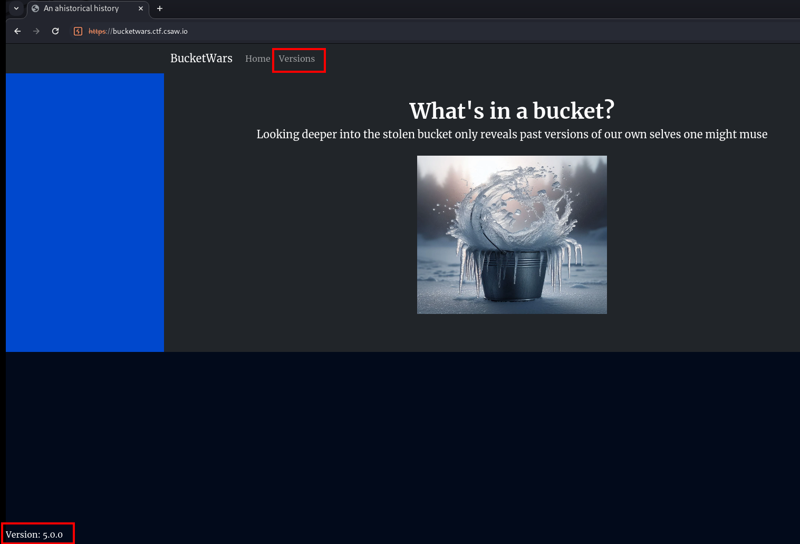
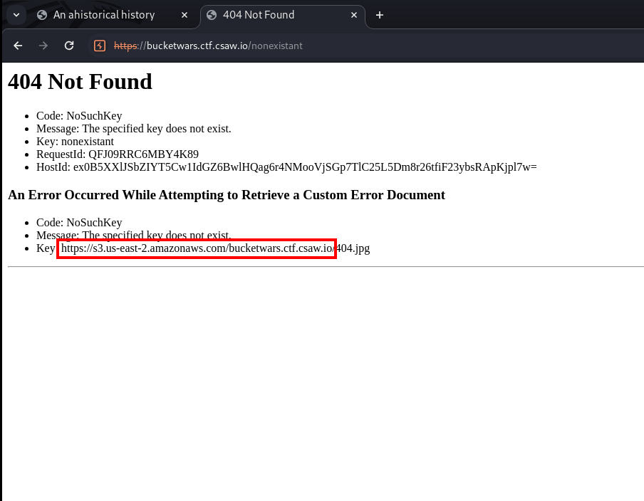
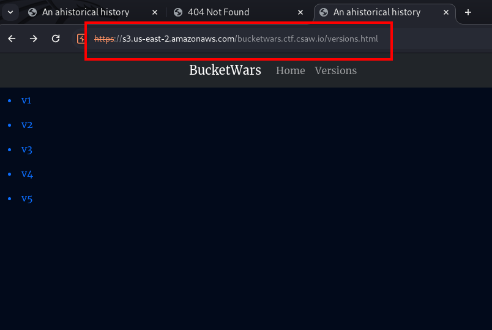

+++
title = 'CSAW CTF Qualification Round 2024 BucketWars'
date = 2024-09-07T12:17:33+02:00
categories = ['CSAW CTF Qualification Round 2024', 'Web']
+++

## Intro

For this challenge we're only given the link *https://bucketwars.ctf.csaw.io* and the description:

> let's keep our storage simple -- and remember we don't make mistakes in these parts.

## Enumerating the Website

Upon visiting the website, we notice the current version *Version: 5.0.0* and the versions page.




When we visit a page that doesn't exist, it tells us that the *404.jpg* is missing from an S3 bucket *https://s3.us-east-2.amazonaws.com/bucketwars.ctf.csaw.io*. We try accessing *index.html* and *versions.html* by using this S3 bucket URL and confirm the website files are served from there.






Sadly, we can't list the bucket contents since it's not public. However, we notice the *x-amz-version-id* header in a response, which hints that there could be different file versions.


## Accessing Previous File Versions

We check each file we found for different versions using AWS CLI. We find out that *index_v1.html* has 5 different versions.

```bash
aws s3api list-object-versions --bucket bucketwars.ctf.csaw.io --prefix index_v1.html > v1_versions
```

```json
{
    "Versions": [
        {
            "ETag": "\"07bb73d00569d07588c0b5661438d9d8\"",
            "Size": 1118,
            "StorageClass": "STANDARD",
            "Key": "index_v1.html",
            "VersionId": "xueLuUGnF1kS6dcOaspeUUZN0N4Cdlsq",
            "IsLatest": true,
            "LastModified": "2024-08-05T01:59:50+00:00"
        },
        {
            "ETag": "\"d3f2f46b2f1814b636cb1c7991a1a328\"",
            "Size": 1290,
            "StorageClass": "STANDARD",
            "Key": "index_v1.html",
            "VersionId": "ToA1N09DluJkPVFATO6IwOTZzhDkva09",
            "IsLatest": false,
            "LastModified": "2024-08-05T00:26:48+00:00"
        },
        {
            "ETag": "\"5c3665517b3e538158ab09b15a647dbb\"",
            "Size": 1456,
            "StorageClass": "STANDARD",
            "Key": "index_v1.html",
            "VersionId": "zCVAK4kjygiOnWWGGi1BZOR87Ef09Z0L",
            "IsLatest": false,
            "LastModified": "2024-08-05T00:20:20+00:00"
        },
        {
            "ETag": "\"9a5824c100e6975c203e2ae517c9ec0d\"",
            "Size": 1555,
            "StorageClass": "STANDARD",
            "Key": "index_v1.html",
            "VersionId": "CFNz2JPIIJfRlNfnVx8a45jgh0J90KxS",
            "IsLatest": false,
            "LastModified": "2024-08-05T00:20:08+00:00"
        },
        {
            "ETag": "\"130f7fdffa9c3a0e24853b651dfe07ac\"",
            "Size": 1571,
            "StorageClass": "STANDARD",
            "Key": "index_v1.html",
            "VersionId": "t6G6A20JCaF5nzz6KuJR6Pj1zePOLAdB",
            "IsLatest": false,
            "LastModified": "2024-08-05T00:19:57+00:00"
        }
    ],
    "RequestCharged": null
}
```

We download each version of the *index_v1.html* file, in particular the 2 last ones.

```bash
aws s3api get-object --bucket bucketwars.ctf.csaw.io --key index_v1.html --version-id CFNz2JPIIJfRlNfnVx8a45jgh0J90KxS index_v1-1555.html
aws s3api get-object --bucket bucketwars.ctf.csaw.io --key index_v1.html --version-id t6G6A20JCaF5nzz6KuJR6Pj1zePOLAdB index_v1-1571.html
```

We diff them.

```bash
vboxuser@kali /mnt/repos/csawctf-2024/bucket-wars $ diff index_v1-1571.html index_v1-1555.html 
28,29c28,29
<     Wait what's here?
<     
---
>     Oh it can't be
>     <!-- Note to self: be sure to delete this password: versions_leaks_buckets_oh_my --> 

```

We got a password and a link to a JPG file served from another bucket. We download the image and check it with *steghide* using the password *versions_leaks_buckets_oh_my* for hidden data.

```bash
vboxuser@kali /mnt/repos/csawctf-2024/bucket-wars $ steghide info sand-pit.jpg
"sand-pit.jpg":
  format: jpeg
  capacity: 11.4 KB
Try to get information about embedded data ? (y/n) y
Enter passphrase: 
  embedded file "flag.txt":
    size: 36.0 Byte
    encrypted: rijndael-128, cbc
    compressed: yes

```

We extract the flag.

```bash
vboxuser@kali /mnt/repos/csawctf-2024/bucket-wars $ steghide extract -sf sand-pit.jpg
Enter passphrase: 
wrote extracted data to "flag.txt".
```

The final flag is: *csawctf{cl0d_Bu4K3tz_AR3_F4Ir_g$m3}*.