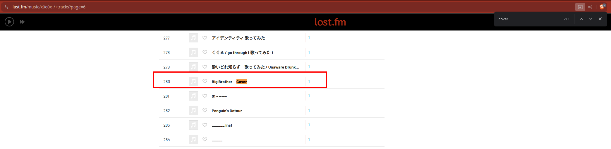

+++
title = 'CSAW CTF Qualification Round 2024 Literally 1984 & Mystery'
date = 2024-09-07T12:17:59+02:00
categories = ['CSAW CTF Qualification Round 2024', 'OSINT']
+++

## Intro

This post covers both *Literally 1984* and *Mystery* as they're related to each other. The description of *Literally 1984* is:

> An artist by the name of ‌ made a cover of a song I liked, but I don't remember the original composer of that song. Could you help me find the original composer?
> Flag Format: csawctf{Firstname_Lastname} (replace all spaces with _ )

and the description of *Mystery* is:

> Remember the composer from Literally 1984? Well, they made a song when they were part of a band in 1992, and it turns out that ‌ also made a cover of this song, collabing with another artist. What is the name of that artist?
> Flag Format: csawctf{ArtistName} (replace all spaces with _ )

## Finding Cover Artist For Literally 1984

The description of *Literally 1984* looks weird. It looks like the artist's name is missing. Upon closer inspection, we notice there's a [zero-width non-joiner](https://en.wikipedia.org/wiki/Zero-width_non-joiner) in the description.

After searching the web, we find the artist *x0o0x_*, whose biography at https://www.last.fm/music/x0o0x_/+wiki states the following:

> Most of their content is uploaded on a nameless channel (this is done by using an invisible control character in unicode. It is encoded as U+200C, the "zero width non-joiner", normally used for ligatures. See Zero-width non-joiner at Wikipedia for more info). 

## Finding Literally 1984 Song 

We check all pages at https://www.last.fm/music/x0o0x_/+tracks for songs with *cover* in the title. The song titled *Big Brother　Cover* stands out, as it could be a reference to [Big Brother](https://en.wikipedia.org/wiki/Big_Brother_(Nineteen_Eighty-Four)) from George Orwell's novel *1984*.

After more searching, we learn that the [original song](https://www.youtube.com/watch?v=hOrTU2NNDVQ) is composed by Susumu Hirasawa. The final flag is: *csawctf{Susumu_Hirasawa}*

## Mystery Uncovered

We find the [P-Model album](https://en.wikipedia.org/wiki/P-Model_(album)) released in 1992 by P-Model, which at the time Susumu Hirasawa was part of. It contains the following songs:

After more web searching, we also stumble upon this [Susumu Hirasawa Remix Collection](https://www.youtube.com/playlist?list=PLREq2ofmD5ozAL4zBgZAhl6e5QfX96lWg). We search it for *x0o0x_* and find a video titled *LAB=01 / Ver.Chogakusei & x0o0x_ [ENG SUB]*

As we saw previously, *LAB=01* is a track included in the *P-Model* album. The final flag is: *csawctf{Chogakusei}*.