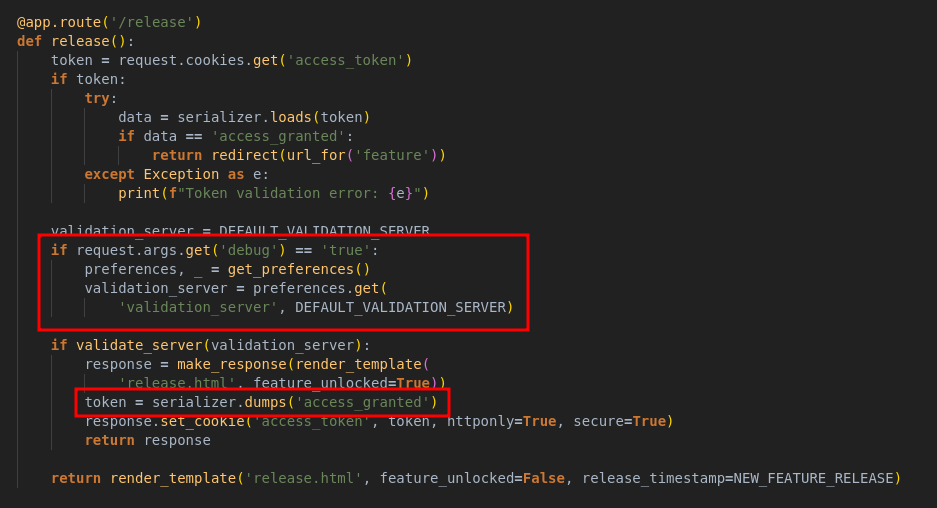
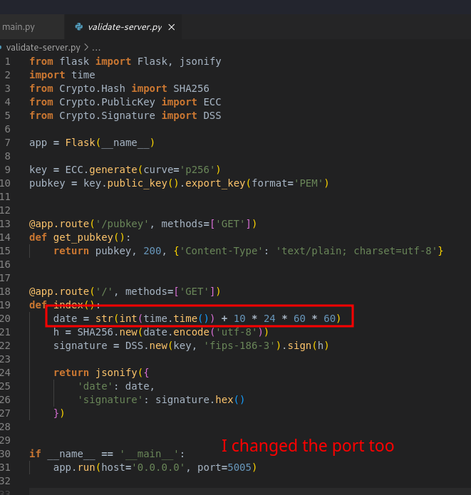
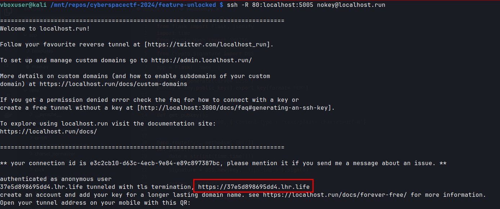
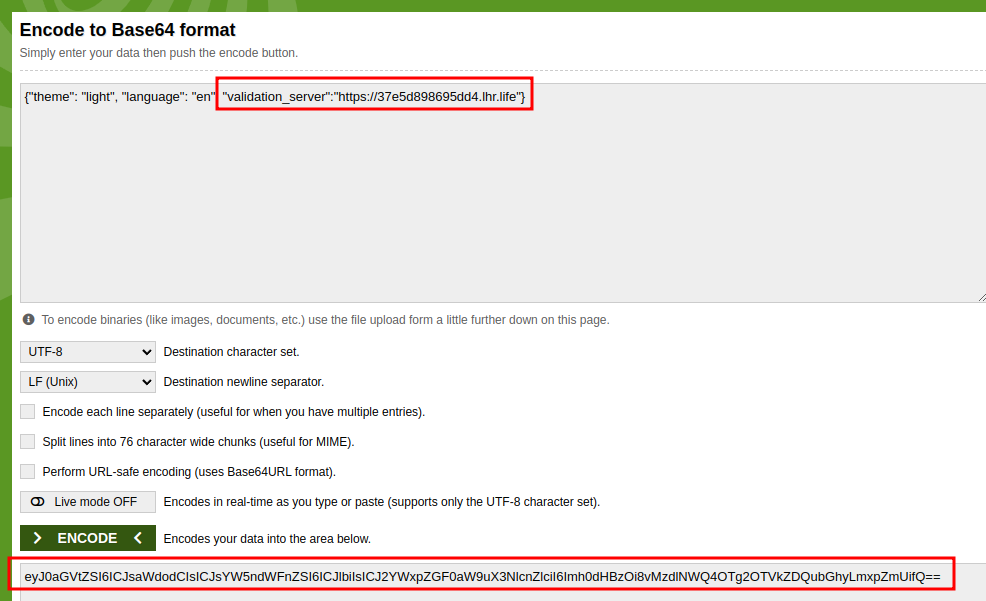
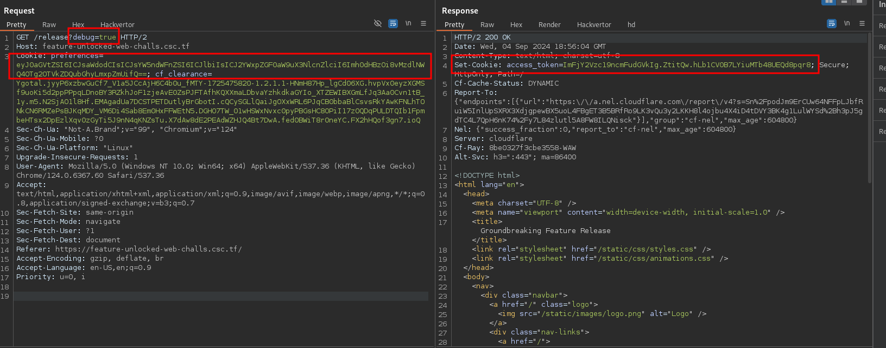

+++
title = 'CyberSpace CTF 2024 Feature Unlocked'
date = 2024-09-03T17:20:52+02:00
categories = ['CyberSpace CTF 2024', 'Web']
+++

## Source Code Analysis

The aim of the challenge is to call the ```POST /feature``` which contains a command injection vulnerability.


As we can see, we need a valid signed ```access_token``` that contains the string ```access_granted```.

There's ```GET /release``` endpoint that'll do exactly that if we pass the ```validate_server(...)``` check. Interestingly, if we set a query param ```debug=true```, we can control the validation server address.



The ```validate_server(validation_server)``` method does the following:
- gets public key from the validation server,
- makes a GET request to the validation serve
- verifies the signature in the response using the ```date``` and the public key,
- returns true if the ```date``` is after ```NEW_FEATURE_RELEASE```(which is set to 7 days in the future), or false otherwise.


Since we can control the verificiation server address and all the data used for verifying the signature comes from it, we can pass ```date``` response we want and produce a valid signature for it.

## Setting Up Malicious Validation Server

There's already code for the validation server in the distribution file.


We copy the code and change the date to 10 days in the future so that it passes the ```NEW_FEATURE_RELEASE``` check, then launch the server and expose it globally.






## Chaining Everything Together

We make a request to ```GET /release?debug=true``` with base64-encoded preferences pointing to our validation server.



We know the validation succeeded from the ```Congratulations! The new feature is now available.``` in the response.


We copy the access token and proceed to ```POST /feature```.



Now we, read the flag by sending ```text=a;cat%20flag.txt%20#``` which makes the server type out the flag, and the rest is skipped with a comment: ```echo a;cat flag.txt # | wc -w```.


The result flag is: ```CSCTF{d1d_y0u_71m3_7r4v3l_f0r_7h15_fl46?!}```.
