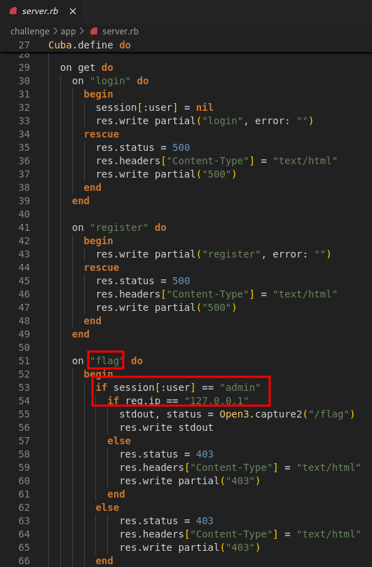
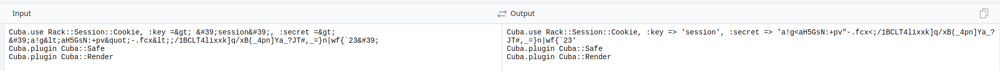
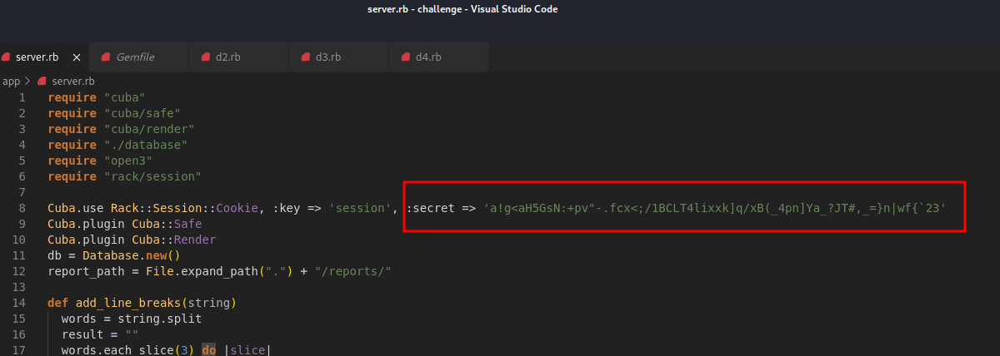
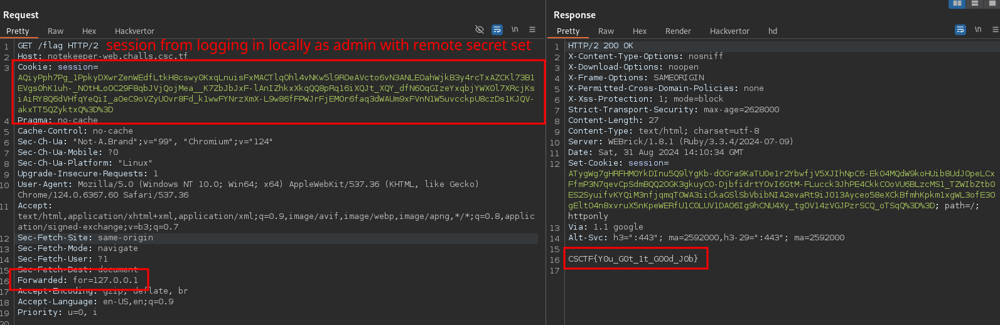

+++
title = 'CyberSpace CTF 2024 Notekeeper'
date = 2024-09-03T17:21:15+02:00
categories = ['CyberSpace CTF 2024', 'Web']
+++

## Source Code Analysis
The goal is to access the `GET /flag` endpoint which calls an executable that prints out the flag. It's guarded by 2 checks:
- ```if session[:user] == "admin"```
- ```if req.ip == "127.0.0.1"```



There's also an interesting ```POST /download``` endpoint. It accepts any session but is also guarded by the ```if req.ip == "127.0.0.1"``` check. It serves a file based on ```filename``` from our request, which leads to LFI.


## Bypassing 127.0.0.1 Restriction

The `127.0.0.1` can be trivially bypassed by adding an `X-Forwarded-For: 127.0.0.1`. This works on local instances but it didn't work on the remote instance during the CTF. As it turned out, the remote instance was behind Google Load Balancer which appended additional forwarded IPs to the header. The server used the last IP in the header for comparison (check the references). Thankfully, Rack supports the ```Forwarded``` header, it takes precedence over ```X-Forwarded``` headers and is not appended to by the load balancer. In conclusion, we can use ```Forwarded: for=127.0.0.1``` to bypass this restriction.

## Leaking Session Secret and Forging Admin Session

We use the 127.0.0.1 bypass and the ```POST /download``` endpoint to reveal the contents of ```server.rb```. This file includes a constant server secret used to forge sessions.


We HTML decode the secret.



Now, we could analyze the source code and write our own script for creating the session, but we just opt for replacing the secret in our local instance with the secret from remote.



Finally, we log in locally as admin, then copy the session, and use it on remote to get the flag.



The final flag is: ```CSCTF{Y0u_G0t_1t_G00d_J0b}```.

## References
- https://datatracker.ietf.org/doc/html/rfc7239
- https://github.com/rack/rack/pull/1834