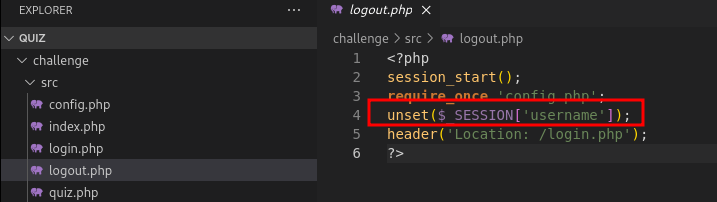
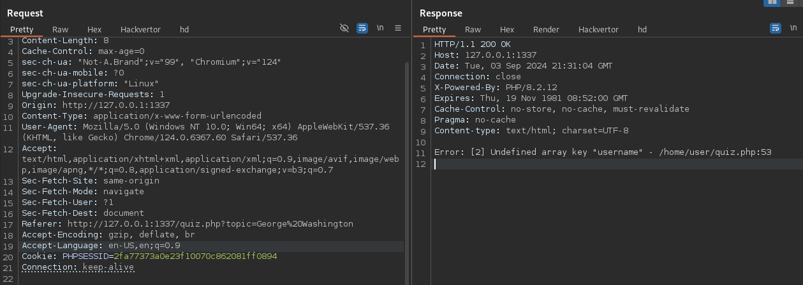
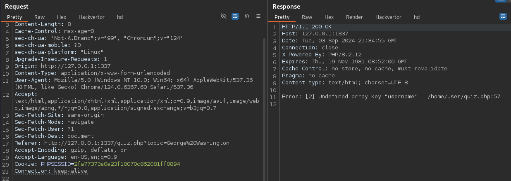
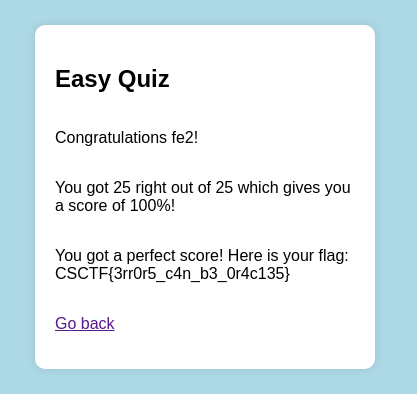

+++
title = 'CyberSpace CTF 2024 Quiz'
date = 2024-09-03T17:20:41+02:00
categories = ['CyberSpace CTF 2024', 'Web']
+++

## Source Code Analysis

At first glance, I thought the intended vulnerability was a race condition. However, upon closer examination I noticed a suspicious ```unset($_SESSION['username']);``` in ```logout.php```.



The correct answer for each question is random, but it's generated in advance both at the beginning of the quiz and upon submitting an answer. 


The ```if (intval($answer) === $next_correct) {...}``` is the essential part of the challenge. Regardless if our answer is correct or wrong, it'll call ```htmlspecialchars($_SESSION['username'])```, which will throw an exception if ```username``` is unset in the session. However, the exception stack trace will show us which line of code the exception was thrown at. Importantly, this all happens before game-related session data is changed, such as ```q_num``` and ```correct```.

## Error Line Number Oracle
We create a new game, then log out and try submitting an answer (using the same sessionId). Since ```logout``` only unsets ```username```, we'll pass the initial check for game data in session, but an exception will be thrown when accessing ```username```.



The error ```Error: [2] Undefined array key "username" - /home/user/quiz.php:53``` tells us exactly at which line of code the error has occurred. Since it's ```53```, it means that the answer we submitted was correct, because the execution entered the ```if (intval($answer) === $next_correct)```. If we enter another answer, the execution will enter the ```else {...}``` clause instead and throw at line ```57```.



With this, we can check which answer is correct without submitting it. The flow to get the flag is register, login, start the quiz then repeat 25 times:
logout -> check which answer is correct (53 in error) -> login -> submit the correct answer.



The final flag is: ```CSCTF{3rr0r5_c4n_b3_0r4c135}```.