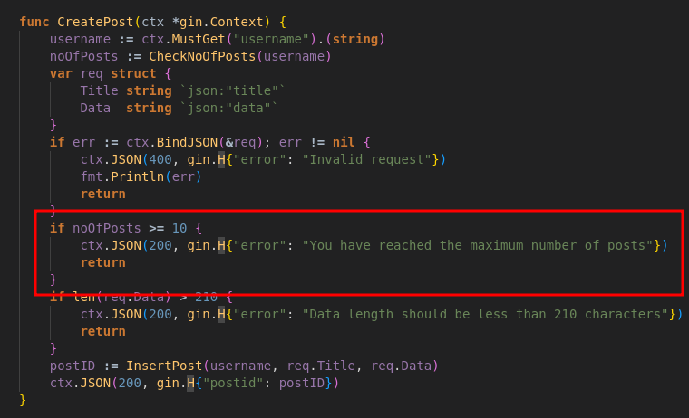
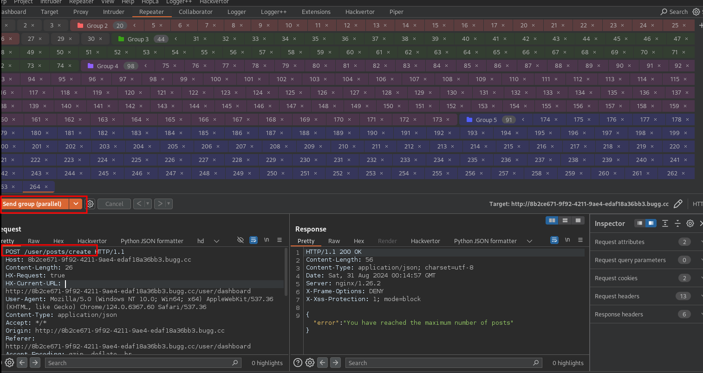
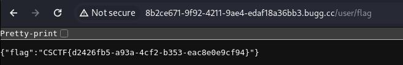

+++
title = 'CyberSpace CTF 2024 Trendz & Trendzz & Trendzzz'
date = 2024-09-03T17:21:10+02:00
categories = ['CyberSpace CTF 2024', 'Web']
draft = true
+++

## Intro

This was a series of 3 web challenges (Trendz, Trendzz and Trendzzz) and 1 rev challenge (Trendzzzz) all related to one application. In this post I'll briefly show how I solved all the web challenges related to it. 

## Race Condition For POST_FLAG

In order to get the POST_FLAG we have to make a request to ```/flag```  after we created 12 posts.


However, the ```CreatePost(...)``` prevents us from submitting new posts once we've created 10 of them.



What if we spammed a lot of requests at the same time? We submit 7 posts, then using Burp prepare a parallel single-packet attack submitting a few dozens of requests at once.



We check the ```GET /flag``` endpoint and find out that we successfully met the requirement of having at least 12 posts.



Flag: ```CSCTF{d2426fb5-a93a-4cf2-b353-eac8e0e9cf94}```.

(If the attack fails for you, try again using another account and play around with the number of requests. The parralel single-byte attack should remove the network jitter, but there could still be internal latency at play).

## XSS For ADMIN_FLAG and SUPERADMIN_FLAG

The organizers prepared a bot for us that'll make ```superadmin``` visit a page with ```refreshtoken``` cookie set.


Using ```/getAccessToken?redirect=foo``` we can make ```superadmin``` get an ```accesstoken``` using the ```refreshtoken``` and navigate to any page we want.


The ```ViewPosts``` method in ```SuperAdminDash.go``` will return ```viewPost.tmpl``` without sanitizing ```data```.


## References
- https://portswigger.net/research/smashing-the-state-machine#single-packet-attack
- https://infosecwriteups.com/hacking-htmx-applications-f8d29665faf